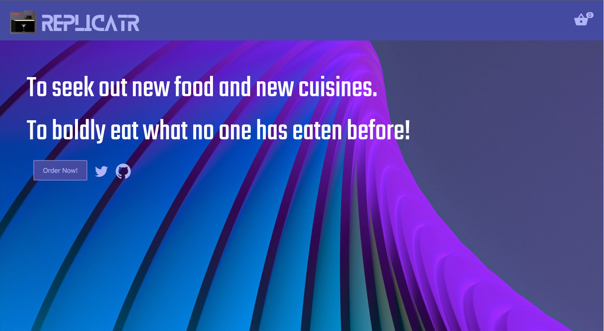

# Synthetics Replicator

This sample futuristic libation order application showcases how to use a common test suite for e2e test suites run within CI pipelines that can also be used for Synthetic Monitoring. It is the main example showcased within the talk *Ctrl > Shift > Left > Right: Joining Dev and Support Forces Together Using e2e Testing and Synthetic Monitoring*.



The application is built using [Svelte](https://svelte.dev/) and [Vite](https://vitejs.dev/).

## Architecture

The aim is to meet the objective of allowing developers, QA engineers, operations agents, and SRE and DevOps experts to use a common approach to test and monitor an application. For this experiment, the following approach is used:

1. e2e test journeys written using [Playwright](https://playwright.dev/) and [Elastic Synthetics](https://github.com/elastic/synthetics).
2. Execution of the e2e test suite within CI using [GitHub Actions](https://docs.github.com/en/actions).
3. Upload of the Synthetic tests from GitHub Actions to [Elastic Synthetics](https://www.elastic.co/observability/synthetic-monitoring).

## Running Locally

Start synthetics-replicator app:

```
npm install
npm start
```

Running the synthetics suite:

```
cd apps/synthetics-replicator-tests
npm install
cd ../../
npm run test
```

## Hosting

The e2e suite serves locally at http://localhost:5173/ both on your local machine and within the CI job. 

For the deployed production instance, Elastic Synthetics pings a live production instance hosted on [Netlify](https://www.netlify.com/) at [https://synthetics-replicator.netlify.app/](https://synthetics-replicator.netlify.app/).

## Data Sources

1. Allergen Information: [14 Allergens | Food Standards Agency](https://www.food.gov.uk/sites/default/files/media/document/top-allergy-types.pdf)
2. Drinks: [The Geeky Bartender by Cassandra Reeder, The Geeky Chef](https://www.amazon.co.uk/Geeky-Bartender-Drinks-Real-Life-Cocktails/dp/1631067095)
3. Food & Drinks: [The Geeky Chef Cookbook by Cassandra Reeder, The Geeky Chef](https://www.amazon.co.uk/gp/product/B00WFEW1LU/ref=dbs_a_def_rwt_hsch_vapi_tkin_p1_i0)